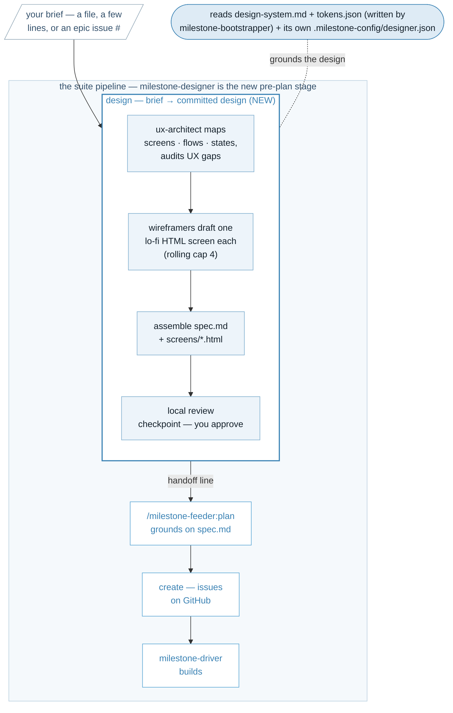

<p align="center">
  
</p>

Turn a feature brief into a reviewable design **before** the work is decomposed into issues — a design spec plus lo-fi wireframes that the rest of the suite builds against.

The [milestone-feeder](https://github.com/kenmulford/milestone-feeder) converts a general plan or idea into a quantifiable brief. However, quantifiable briefs can be implemented many ways. The milestone-designer helps close the gap between what you expect and what Claude delivers by the end of the [driver](https://github.com/kenmulford/milestone-driver). Wireframes, visual designs, and manual approval all contribute to the accuracy of the feeder's planning and driver's implementation.

**Recommended — the milestone-suite marketplace.** One marketplace carries every suite plugin, so you add it once and install whichever you want:

```
/plugin marketplace add kenmulford/milestone-suite
/plugin install milestone-designer@milestone-suite
```

**Alternative — this repo's own marketplace.** Still supported if you only want milestone-designer:

```
/plugin marketplace add kenmulford/milestone-designer
/plugin install milestone-designer@milestone-designer
```



## Quick start

Two commands — `design`, and `setup` when you want to inspect or tune the config. The loop:

1. **`design` your brief.** Put your brief in a file (a paragraph is plenty), paste it inline, or point at a GitHub epic issue (e.g. `#42`):

   ```
   /milestone-designer:design mybrief.md
   ```

   It reads your project's `design-system.md` and `tokens.json`, maps the screens/flows/states the brief implies, resolves the UX gaps that have a conventional default (each with a citation) and parks the ones that are real product calls, then writes a **design artifact set** you can read. It stops at a review checkpoint before anything is handed downstream.

2. **Review the wireframes.** It opens the lo-fi screens in your local browser and **blocks on your approval** — this checkpoint cannot be skipped by any flag. Approve and it prints the handoff line to `milestone-feeder`; reject and the artifacts stay untouched while you fix the brief or docs and re-run.

3. **Hand off to `plan`.** On approval you get the next command verbatim:

   ```
   /milestone-feeder:plan mybrief.md
   ```

   The feeder finds the design by the same deterministic slug and grounds its issues on `spec.md`, so the UI issues clear the driver's design-reviewer by construction.

The first time you run `design` in a repo with no config, it bootstraps `designer.json` for you and carries on — you don't re-run anything.

### The artifact set

Every approved run commits, under the configured design dir (default `docs/designs/`):

```
docs/designs/<slug>/
  spec.md          # flows, per-screen layout/states/affordances, gap resolutions with citations
  screens/*.html   # lo-fi wireframes — one self-contained HTML file per screen
  exports/*        # PNG/SVG exports — only for adapters that cannot emit HTML
```

`spec.md` is written in the driver design-reviewer's own vocabulary — layout/grouping, the four required states (empty / loading / error / disabled), affordances including confirm-on-destructive, and a pattern-to-mirror per screen. `<slug>` is derived by the same rule the feeder uses to name `plan-<slug>.md`, so the feeder finds the design with no configuration. Downstream tools consume only these committed files — never a design tool.

## Before you start

milestone-designer writes **only local repo files** — it never touches GitHub state, and `gh` is never a runtime prerequisite. A few things shape what it can do:

- **A filled `design-system.md` and `tokens.json`** under your project docs (written by `milestone-bootstrapper`). If either is absent or entirely `[TBD]`, there is no UI surface to design: the run exits immediately, writing nothing, with a quotable notice —

  ```
  No UI surface for this brief: design-system.md / tokens.json are absent or
  all-[TBD], so no design phase applies. Nothing was written. Proceed to
  /milestone-feeder:plan <brief> when ready.
  ```

- **Claude allowed to Read your project docs and existing UI surfaces**, and to Write under the design dir — that's the whole footprint.
- **A browser** for the local review checkpoint.
- **bash with `jq`, or PowerShell 7+** — for the CI gate twins.
- **`gh` only if your brief is an epic issue `#n`** — that's the one read. If `gh` is unavailable, paste the brief text or point at a file instead; it is never required.

### Optional — DesignSync review

Under the default `claude-design` adapter, the review checkpoint can additionally push the wireframes to the claude.ai Design System pane (cards grouped by feature slug) when a claude.ai login with design scopes exists. It is **permission-gated and per-plan**. The first granted push asks you to pick (or create) a Design System project and remembers the choice in `designer.json`; later pushes reuse it silently. A missing login, missing scopes, or any push failure degrades silently to local browser review and **never fails the run** — the repo files are canonical; claude.ai is a one-way, optional view.

## Config

Configuration is **optional** — every setting has a default, so the tool runs with no config at all. When you want to tune it, the settings live in `.milestone-config/designer.json` (the same folder `milestone-driver` and `milestone-feeder` keep their config in). The first `design` run writes this file for you, and you can inspect or repair it any time:

```
/milestone-designer:setup
```

| Key | Default | What it does |
|---|---|---|
| `designTool` | `claude-design` | The design adapter. Only `claude-design` is implemented in v1. |
| `designDocsDir` | `docs/designs` | Where the artifact set is committed. |
| `uxArchitectAgent` | `milestone-designer:ux-architect` | The gap-auditing screen/flow/state inventory agent. |
| `wireframerAgent` | `milestone-designer:wireframer` | The per-screen lo-fi HTML wireframer. |

The build-side keys — your UI-surface globs (`uiSurfaceGlobs`) and project-docs path (`projectDocs`) — are **read from your existing driver/feeder config**, never duplicated here. A `designer.json` carrying either of them is a bug.

## Status

**v0.1.0 — initial release.** The live surface is `design` and `setup`. `design` runs the full flow: the no-UI-surface gate, one `ux-architect` dispatch, a rolling-cap-4 `wireframer` fan-out, spec assembly, and the unskippable local review checkpoint with an optional DesignSync push. Re-running on an unchanged brief is a diff-shown no-op. The design tool is swappable behind the `designTool` seam; the committed artifact contract is not. For the full version history, see [CHANGELOG.md](CHANGELOG.md).

**Non-goals (what it deliberately isn't):**

- **It does not modify the sibling plugins.** The feeder / driver / bootstrapper / suite integrations are small, separately-shippable follow-ups.
- **It is not a design-review tool** — the driver's design-reviewer keeps that job; there is no duplicate review lens here.
- **It is not a component-library manager** — it *consumes* `design-system.md` / `tokens.json`, it does not author them (that's the bootstrapper interview).
- **No Figma / Canva / Pencil implementation in v1** — those adapters are documented contract only, with no runtime dispatch. Selecting one halts with a clear notice.

## Docs

- [docs/artifact-contract.md](docs/artifact-contract.md): the committed-file interface everything downstream grounds on.
- [docs/adapter-seam.md](docs/adapter-seam.md): the `designTool` seam and the DesignSync push mechanics.
- [docs/milestone-designer-brief.md](docs/milestone-designer-brief.md): the brief the suite is building this from.

## License

[MIT](LICENSE).
